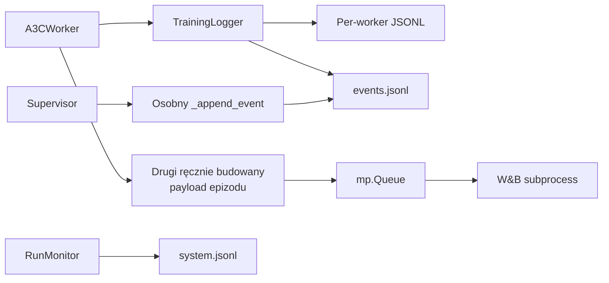
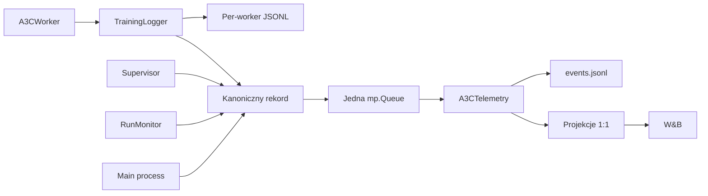
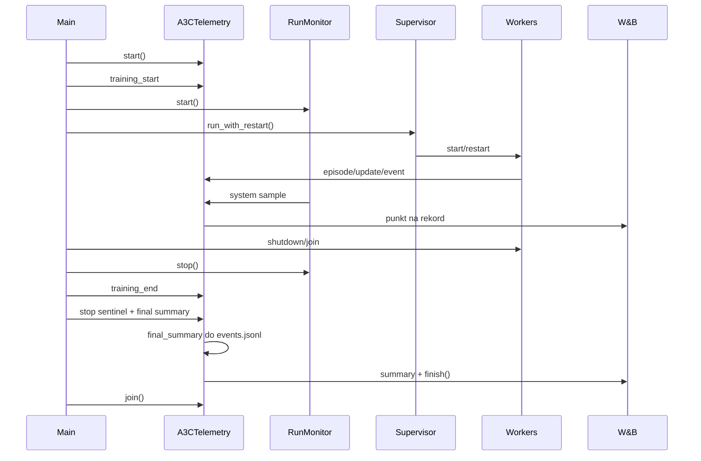

# Refaktor logowania A3C — przewodnik do code review

> Stan na 29 lipca 2026 r.: commit `b551390` („logging refactor draft")
> plus niezatwierdzone zmiany w katalogu roboczym. Dokument opisuje
> docelowy kształt systemu logowania i jest przeznaczony dla reviewera
> znającego repozytorium.

## Spis treści

1. [Zakres zmian](#1-zakres-zmian)
2. [Streszczenie dla reviewera](#2-streszczenie-dla-reviewera)
3. [Architektura przed i po](#3-architektura-przed-i-po)
4. [Kanoniczny rekord](#4-kanoniczny-rekord)
5. [Ścieżka lokalna](#5-ścieżka-lokalna)
6. [Ścieżka telemetrii](#6-ścieżka-telemetrii)
7. [Co dokładnie trafia do W&B](#7-co-dokładnie-trafia-do-wb)
8. [Przepływ uruchomienia i zamykania](#8-przepływ-uruchomienia-i-zamykania)
9. [Zmiany według plików](#9-zmiany-według-plików)
10. [Kompatybilność i ograniczenia](#10-kompatybilność-i-ograniczenia)
11. [Co świadomie pozostawiono bez zmian](#11-co-świadomie-pozostawiono-bez-zmian)
12. [Testy i weryfikacja](#12-testy-i-weryfikacja)
13. [Checklista code review](#13-checklista-code-review)

---

## 1. Zakres zmian

| Plik | Rola |
|---|---|
| `A3C/new_hogwild_training_logger.py` | Kanoniczne rekordy, strict JSON, kolejka, projekcje W&B, proces telemetrii |
| `A3C/new_hogwild_train_a3c_carla.py` | Konfiguracja i cykl życia procesu telemetrii |
| `A3C/new_hogwild_a3c.py` | Podłączenie workerów, epizodów, update'ów i gradientów |
| `A3C/new_hogwild_run_a3c.py` | Ujednolicenie eventów supervisora |
| `A3C/new_hogwild_system_monitor.py` | Przekazywanie próbek systemowych do telemetrii |
| `A3C/tests/test_logging_design.py` | Testy kontraktowe wierności logowania |

Poza zakresem: matematyka treningu, checkpointy, reward shaping, wrapper
CARLA, zmiany IDE i ścieżek.

Wcześniejsze dokumenty analityczne (`logging-analysis-and-refactor-proposal.md`,
`plan.md`, `comparison.md`) zostały usunięte z repozytorium. Ten plik jest
jedynym aktualnym opisem systemu logowania.

---

## 2. Streszczenie dla reviewera

| Przed refaktorem | Po refaktorze | Dlaczego |
|---|---|---|
| Lokalny JSONL i W&B dostawały dwa osobno budowane rekordy epizodu | Ten sam kanoniczny rekord jest zapisywany lokalnie i publikowany do telemetrii | Eliminuje rozjazdy nazw i pól |
| Wiele procesów dopisywało do `events.jsonl` | Jeden proces telemetrii jest jedynym writerem | Usuwa konkurencyjny zapis |
| W&B otrzymywał praktycznie tylko epizody | W&B dostaje epizody, każdy update, próbki systemowe i liczniki zdrowotne | Umożliwia zdalną diagnostykę na klastrze |
| Loggery otwierały wszystkie JSONL przy inicjalizacji | Pliki otwierane leniwie | Nie powstają puste pliki i katalogi |
| JSON mógł zawierać `NaN`/`Infinity` | Wartości normalizowane do strict JSON | Logi poprawne i przenośne |
| Błędy W&B i pełna kolejka ignorowane | Liczniki `queue_drops` i `wandb_errors` w `events.jsonl` i W&B summary | Utrata telemetrii jest mierzalna |

Dwie naczelne zasady:

> **Lokalne pliki JSONL są kompletnym zapisem runu.** Każdy rekord, każde
> pole, dokładne wartości.

> **Telemetria nie modyfikuje wartości.** Każdy rekord trafia do W&B jako
> osobny punkt z wartościami wyprodukowanymi przez trening. Nie ma
> uśredniania, batchowania ani downsamplingu.

---

## 3. Architektura przed i po

### 3.1. Przed



Problemy: dwa niezależne mappery epizodu, dwóch writerów `events.jsonl`,
brak strat i gradientów w W&B, ciche gubienie rekordów.

### 3.2. Po



Dwie niezależne ścieżki:

- **lokalna** — każdy proces pisze do własnego katalogu, bez współdzielenia,
  bez lockowania;
- **telemetryjna** — jedna kolejka, jeden konsument, który jest jedynym
  writerem `events.jsonl` i jedynym wywołującym `wandb.*`.

---

## 4. Kanoniczny rekord

Sześć typów rekordów:

```python
RECORD_KINDS = frozenset(
    ('step', 'episode', 'update', 'timing', 'system', 'event'))
```

Każdy przechodzi przez `build_record()`:

```python
def build_record(kind, worker_id=None, data=None):
    """Wrap ``data`` in the envelope shared by local logs and telemetry.

    ``kind`` is how the telemetry consumer routes the record and must be
    one of ``RECORD_KINDS``.  ``worker_id`` is the source worker, or
    ``-1``/``None`` for run-level records.  Runs that resume an existing
    output directory are told apart by the ``training_start`` and
    ``training_end`` events in ``events.jsonl``.
    """
    if kind not in RECORD_KINDS:
        raise ValueError('unsupported record kind: {}'.format(kind))
    record = dict(data or {})
    record['kind'] = kind
    record['ts'] = record.get('ts') or _timestamp()
    record['worker'] = worker_id
    return normalize_for_json(record)
```

| Pole | Znaczenie |
|---|---|
| `kind` | Routing w procesie telemetrii |
| `ts` | Czas utworzenia rekordu |
| `worker` | Źródłowy worker albo `-1`/`None` dla rekordów globalnych |
| `global_t` | Wspólna oś postępu treningu, jeśli rekord ją posiada |

### Rozdzielanie sesji po `--resume`

Pliki JSONL są dopisywane, a po wznowieniu `global_t` cofa się do
wartości z checkpointu, więc plik zawiera nakładające się zakresy.
Granice sesji wyznacza para eventów `training_start` / `training_end`
w `events.jsonl`, z timestampami i `global_t`. Repozytorium już z tego
korzysta — `_read_resume_state()` odtwarza skumulowany czas treningu
czytając `training_end`.

Osobny identyfikator sesji w kopercie rekordu był rozważany i został
odrzucony: przechodziłby przez dwanaście sygnatur w pięciu plikach,
nikt by go nie czytał, a granice sesji są już zapisane w eventach.

### Strict JSON

`normalize_for_json()` obsługuje typy Pythona, NumPy, PyTorch i kolekcje
zagnieżdżone. `NaN`, `Infinity` i `-Infinity` stają się `null`, bo strict
JSON ich nie reprezentuje. Zapis wymusza `allow_nan=False`.

---

## 5. Ścieżka lokalna

`TrainingLogger` — jedna instancja na proces: po jednej w każdym workerze
plus jedna w procesie głównym (`worker_id=-1`, wyłącznie eventy).

```python
    def _open(self, name):
        handle = self._files.get(name)
        if handle is None:
            os.makedirs(self.log_dir, exist_ok=True)
            handle = open(
                os.path.join(self.log_dir, name), 'a', buffering=1)
            self._files[name] = handle
        return handle
```

Leniwe otwieranie: katalog i plik powstają przy pierwszym rzeczywistym
zapisie. Dzięki temu `worker_-1/` nie powstaje wcale.

Kolejność w każdej metodzie `log_*`: **najpierw zapis lokalny, potem
publikacja**.

```python
        record = self._write(
            'episodes.jsonl', self._record('episode', data))
        self._publish(record)
        return record
```

Pełna kolejka ani martwy proces telemetrii nie mogą uszkodzić
`episodes.jsonl`. Lokalny plik jest zawsze nadzbiorem tego, co poszło
zdalnie.

### Pliki

| Plik | Zawartość | Domyślnie |
|---|---|---|
| `logs/worker_<id>/episodes.jsonl` | Każdy epizod | wł. |
| `logs/worker_<id>/updates.jsonl` | Każdy update optymalizatora | wł. |
| `logs/worker_<id>/timing.jsonl` | Profil czasu operacji | wł. |
| `logs/worker_<id>/steps.jsonl` | Każdy krok środowiska | wył. (`--log-steps`) |
| `logs/worker_<id>/system.jsonl` | Zasoby procesu workera | wł. |
| `logs/system.jsonl` | Zasoby węzła, CARLA, GPU | wł. |
| `logs/events.jsonl` | Eventy z całego runu, jeden writer | wł. |
| `logs/metadata.json` | Konfiguracja, model, liczba parametrów | wł. |

Surowe tablice update'u (`advantages`, `values`, `rewards`, `entropies`)
zapisywane tylko przy `--log-update-arrays`.

---

## 6. Ścieżka telemetrii

### 6.1. Publikacja

```python
def enqueue_telemetry(telemetry_queue, record, is_event=False,
                      dropped_counter=None):
    """Hand one record to the telemetry process without blocking training.

    Metrics are dropped the moment the queue is full.  Events matter more,
    so they wait up to ``_EVENT_ENQUEUE_TIMEOUT_S`` for space before being
    dropped as well.  Every drop bumps ``dropped_counter``, which the final
    summary reports.  Returns whether the record was accepted.
    """
    if telemetry_queue is None:
        return False
    try:
        if is_event:
            telemetry_queue.put(
                record, timeout=_EVENT_ENQUEUE_TIMEOUT_S)
        else:
            telemetry_queue.put_nowait(record)
        return True
    except queue_module.Full:
        _increment_counter(dropped_counter)
        if is_event:
            print('[TELEMETRY] event dropped: queue full', flush=True)
        return False
```

Jedyne API strony producenta. Nigdy nie rzuca wyjątkiem i nigdy nie
blokuje treningu dłużej niż sekundę.

| Rodzaj | Lokalny zapis | Kolejka | Przy pełnej kolejce |
|---|---|---|---|
| `step` | Tak, opt-in | Nie | — |
| `episode` | Tak | Tak, gdy W&B aktywny | Natychmiastowy drop |
| `update` | Tak | Tak, gdy W&B aktywny | Natychmiastowy drop |
| `timing` | Tak | Nie | — |
| run-level `system` | Tak | Tak, gdy W&B aktywny | Natychmiastowy drop |
| `event` | Przez proces telemetrii | Zawsze | Próba do 1 s, potem drop |

Kolejka: `mp.Queue(maxsize=TELEMETRY_QUEUE_SIZE)`, obecnie 10000.

### 6.2. Jeden writer `events.jsonl`

Worker i supervisor tylko publikują rekord. Plik otwiera wyłącznie
`run_telemetry_loop()`:

```python
    with open(events_path, 'a', buffering=1) as events_handle:
        def write_event(record):
            events_handle.write(json.dumps(
                normalize_for_json(record), allow_nan=False) + '\n')
```

Usunięto dwie konkurujące implementacje: bezpośredni zapis w
`TrainingLogger.log_event()` i supervisorowe `_append_event()`.

### 6.3. Routing

```python
_PROJECTIONS = {
    'episode': project_episode_to_wandb,
    'update': project_update_to_wandb,
    'system': project_system_to_wandb,
}
```

```python
            kind = record.get('kind')
            if kind == 'event':
                # Events go to disk first: a broken W&B must not cost one.
                write_event(record)
                metric = _HEALTH_METRICS.get(record.get('event'))
                if metric:
                    health_counts[metric] = health_counts.get(metric, 0) + 1
                    payload = {metric: health_counts[metric]}
                    _put_metric(payload, 'global_step',
                                record.get('global_t'))
                    log_wandb(payload)
            elif kind in _PROJECTIONS:
                log_wandb(_PROJECTIONS[kind](record))
```

Event trafia na dysk **przed** próbą wysłania metryki — padnięcie W&B nie
może kosztować wpisu w `events.jsonl`.

### 6.4. Izolacja błędów W&B

Wszystkie wywołania `wandb.log` przechodzą przez jedno domknięcie, które
połyka wyjątki, zlicza je w `wandb_errors` i throttluje komunikaty do
pierwszego i co setnego. Sieć nie może zabić pętli telemetrii.

---

## 7. Co dokładnie trafia do W&B

Filtr `_put_metric()` przepuszcza wyłącznie skończone liczby i boole
(bool → 0/1). Listy, słowniki, ścieżki i `NaN` odpadają cicho.

### 7.1. Epizod — każdy, natychmiast

```
global_step
episode/id, episode/reward, episode/reward_per_step, episode/length,
episode/duration_s, episode/success, episode/max_speed_kmh,
episode/min_route_distance, episode/goal_distance, episode/collisions
episode/action_<n>_fraction        (dla każdej akcji)
episode/reward_<komponent>         (z reward_components, bez 'total')
global/reward_mean, global/best_reward
worker_<id>/reward, worker_<id>/episode_length,
worker_<id>/reward_mean_100
```

### 7.2. Update — każdy, natychmiast

```
global_step
train/pi_loss, train/v_loss, train/total_loss
train/gradient_norm, train/gradient_norm_pre_clip, train/grad_clipped
train/entropy, train/entropy_coef, train/lr
train/advantages_mean, train/advantages_std
train/value_mean, train/value_std
train/reward_mean, train/reward_sum
train/trajectory_length
train/reward_<komponent>_sum, train/reward_<komponent>_mean
worker_<id>/train/<każda z powyższych>
```

Duplikacja per worker jest celowa: `train/*` daje widok globalny
(przeplot wszystkich workerów), `worker_<id>/train/*` pozwala wykryć
pojedynczego workera odstającego od reszty. Przy 16 workerach daje to
ok. 340 serii — W&B to udźwignie.

### 7.3. System — każda próbka, natychmiast

```
global_step
system/cpu_percent_mean, system/cpu_percent_max
system/mem_percent, system/mem_available_gb, system/swap_used_gb
system/gpu<n>_util_percent, system/gpu<n>_mem_used_gb
```

### 7.4. Zdrowie — monotoniczne liczniki

```python
_HEALTH_METRICS = {
    'nan_gradient': 'health/nan_updates_total',
    'camera_timeout': 'health/camera_timeouts_total',
    'worker_crash': 'health/worker_crashes_total',
    'worker_restart': 'health/worker_restarts_total',
    'worker_give_up': 'health/workers_given_up_total',
    'rollback': 'health/rollbacks_total',
}
```

Wszystkie sześć typów jest faktycznie emitowanych przez kod. Treść eventu
(komunikat błędu, ścieżka, `nan_layers`) zostaje w `events.jsonl`; do W&B
idzie wyłącznie licznik.

### 7.5. Co zostaje tylko lokalnie

- cały `timing.jsonl` — profil czasu operacji;
- `WorkerMonitor` — zasoby per worker;
- sekcja `carla` rekordu systemowego oraz `mem_used_gb`, `cpu_freq_mhz`,
  `total_procs`, `total_rss_gb`, `gpu.mem_total_gb`;
- surowe tablice update'u;
- `steps.jsonl`;
- treść eventów;
- `port`, `is_new_best`, surowe `action_counts`.

To świadomy podział: W&B ma dawać zdalny podgląd przebiegu uczenia, pełna
diagnostyka zawsze wymaga zejścia do plików lokalnych.

---

## 8. Przepływ uruchomienia i zamykania

### 8.1. Start

```python
    log_queue = mp.Queue(maxsize=TELEMETRY_QUEUE_SIZE)
    telemetry_counters = {
        'queue_drops': mp.Value('l', 0),
        'wandb_errors': mp.Value('l', 0),
    }
```

Proces telemetrii startuje także przy `--no-wandb`, ponieważ nadal
obsługuje `events.jsonl`. `wandb` jest importowany wyłącznie w tym
procesie; główny używa `importlib.util.find_spec`.

### 8.2. Kolejność



### 8.3. Kontrolowane zakończenie

Sentinel niesie końcowe metryki. Po jego odebraniu proces telemetrii:

1. scala `final_summary` z licznikami zdrowotnymi i współdzielonymi;
2. zapisuje je jako event `final_summary` w `events.jsonl`;
3. aktualizuje W&B summary;
4. kończy pętlę i wywołuje `wandb.finish()`.

Zapis do `events.jsonl` następuje **przed** próbą wysłania do W&B, więc
końcowe liczniki przetrwają także przy `--no-wandb` i przy padniętej
sieci.

Entry point czeka maksymalnie 30 sekund, potem `terminate()`.

### 8.4. Obsługa błędu treningu

Wyjątek jest zapamiętywany w `failure`, cleanup wykonuje się w `finally`,
a po zapisaniu `training_end`, resume state i końcowych metryk wyjątek
jest ponownie zgłaszany. Awaria nie jest maskowana, ale run zostawia
komplet informacji diagnostycznych.

---

## 9. Zmiany według plików

### `new_hogwild_training_logger.py`

- rekurencyjny strict JSON zamiast prostego `_json_default()`;
- kanoniczne rekordy i wspólne API kolejki;
- leniwe otwieranie JSONL;
- trzy projekcje 1:1 (`project_episode_to_wandb`,
  `project_update_to_wandb`, `project_system_to_wandb`) i routing przez
  słownik `_PROJECTIONS`;
- liczniki zdrowotne;
- jeden event sink;
- `final_summary` utrwalany lokalnie;
- inicjalizacja, obsługa błędów i zamknięcie W&B.

### `new_hogwild_train_a3c_carla.py`

- W&B nie jest importowane w procesie głównym;
- kolejka istnieje zawsze, stała `TELEMETRY_QUEUE_SIZE`;
- dodano liczniki `queue_drops` i `wandb_errors`;
- dodano proces `A3CTelemetry`;
- `training_start`, `wandb_unavailable`, `training_end` przez kolejkę;
- `RunMonitor` dostaje callback telemetrii;
- uporządkowany shutdown i ponowne zgłaszanie błędów.

### `new_hogwild_a3c.py`

- worker otrzymuje licznik dropów;
- `TrainingLogger` otrzymuje kolejkę i flagę `publish_metrics`;
- usunięto ręcznie budowany payload W&B;
- dodano `clip_gradients_and_measure()`: norma przed i po clippingu oraz
  flaga `grad_clipped`, bez drugiego clippingu i bez zmiany wzoru straty;
- `--no-system-monitor` obejmuje też monitor workera.

### `new_hogwild_run_a3c.py`

- usunięto `_append_event()` i jego bezpośredni zapis JSON;
- dodano `_emit_event()` oparty o kanoniczny rekord;
- supervisor przekazuje licznik dropów do workerów;
- `run_with_restart()` zwraca końcowe liczniki restartów.

### `new_hogwild_system_monitor.py`

- wspólna normalizacja strict JSON;
- wyodrębnienie `_collect_and_write()`;
- opcjonalny callback z run-level system sample;
- lokalna struktura `system.jsonl` bez zmian.

---

## 10. Kompatybilność i ograniczenia

### 10.1. Nazwy metryk W&B

Nowy model używa spójnych namespace'ów: `episode/*`, `global/*`,
`train/*`, `worker_<id>/*`, `system/*`, `health/*`.

Przykładowe niekompatybilności ze stanem sprzed refaktoru:

| Stara nazwa | Nowa |
|---|---|
| `episode` | `episode/id` |
| `worker/2/reward` | `worker_2/reward` |
| `worker/2/global_mean_reward` | `global/reward_mean` |
| `worker/2/action_0` | `episode/action_0_fraction` |
| `worker/2/distance_from_target` | `episode/goal_distance` |

Istniejące dashboardy i alerty wymagają aktualizacji.

### 10.2. Telemetria pozostaje best-effort

Pełna kolejka nie zatrzymuje treningu. Może to oznaczać luki w W&B, przy
kompletnych logach lokalnych. Eventy są traktowane priorytetowo, ale nawet
one są odrzucane po jednosekundowym timeoucie. Każdy drop zwiększa
`queue_drops`, raportowany w `events.jsonl` i w W&B summary.

### 10.3. Wolumen W&B

Przy 16 workerach i `rollout_length=20` to ok. 16 punktów na sekundę,
czyli ok. 460 tys. wierszy historii na ośmiogodzinny run. W&B to obsłuży
(downsampling w UI), ale wykresy ładują się wolniej. Nie ma obecnie
przełącznika zmniejszającego tę częstotliwość — usunięto go świadomie,
bo każda forma agregacji zmienia logowane wartości.

### 10.4. Awaryjne zakończenie procesu telemetrii

Jeżeli sentinel nie może zostać dodany albo proces nie opróżni kolejki
w ciągu 30 sekund, main używa `terminate()`. Ostatnie eventy, liczniki
zdrowotne i `wandb.finish()` mogą wtedy nie zostać wykonane. Rekordy
znajdujące się w buforze feedera giną bez śladu.

### 10.5. `NaN` w logach

`NaN`/`Inf` stają się `null` bez osobnego licznika. Najważniejszy
przypadek — NaN w gradientach — jest pokryty eventem `nan_gradient`
z polami `nan_count` i `nan_layers` oraz licznikiem
`health/nan_updates_total`. `null` w innych polach pozostaje
dwuznaczny (brak pola albo wartość niefinitywna).

### 10.6. `train/*` miesza workery

Seria globalna `train/pi_loss` to przeplot punktów ze wszystkich
workerów w kolejności przybycia do kolejki. Rozbicie per worker jest
dostępne pod `worker_<id>/train/*`.

---

## 11. Co świadomie pozostawiono bez zmian

- wzór `total_loss`, optymalizator i jego stan;
- kolejność aktualizacji A3C;
- checkpointy i rollback;
- zawartość oraz semantyka `resume_state.json`;
- rolling reward i semantyka epizodu;
- reward shaping i wrapper CARLA;
- `args.txt` i `args_resume.txt`;
- lokalne nazwy istniejących pól JSONL;
- domyślnie wyłączone `steps.jsonl` i surowe tablice update'u.

Nie zunifikowano dwóch miejsc zapisu `resume_state.json` i nie usunięto
`args*.txt`. To celowe ograniczenie zakresu.

---

## 12. Testy i weryfikacja

Wykonano na maszynie deweloperskiej, bez CARLA i bez sieciowego backendu
W&B.

### 12.1. Testy kontraktowe

```bash
./.venv/bin/python -m unittest A3C/test_logging_design.py
```

```text
Ran 10 tests in 0.612s

OK
```

Pokrywają: dokładność wartości update'u, komponenty reward `_sum` i
`_mean`, odrzucanie surowych tablic, namespace per worker, brak
`worker_-1`, bezwarunkowe logowanie `lr`, dokładność próbki systemowej,
jeden punkt W&B na rekord, utrwalenie `final_summary` bez W&B.

### 12.2. Smoke wieloprocesowy bez W&B

Cztery procesy workerów przez `spawn`, prawdziwa `mp.Queue`, prawdziwy
proces telemetrii. Sprawdzane: komplet i dokładność lokalnych
`updates.jsonl`, brak surowych tablic domyślnie, wszystkie eventy
u jedynego writera, `final_summary` z licznikami na dysku, `NaN` → `null`,
brak katalogu `worker_-1`, zerowy exit code telemetrii. Wynik: 19/19 PASS.

### 12.3. Smoke ścieżki W&B

Atrapa modułu `wandb` podstawiona przez `PYTHONPATH`, trzy procesy
workerów. Wynik: 10/10 PASS — 75 update'ów dało 75 punktów, wartości per
worker dokładne i kompletne, 12 epizodów dało 12 punktów, próbka
systemowa niezmieniona, `worker_<id>/*` zadeklarowane przez
`define_metric`, `wandb.finish()` wywołany.

### 12.4. Kontrole statyczne

```bash
./.venv/bin/python -m py_compile \
  A3C/new_hogwild_training_logger.py \
  A3C/new_hogwild_train_a3c_carla.py \
  A3C/new_hogwild_a3c.py \
  A3C/new_hogwild_system_monitor.py \
  A3C/new_hogwild_run_a3c.py \
  A3C/test_logging_design.py

git diff --check HEAD -- A3C
```

Oba zakończone kodem `0`. Ponadto: wyłącznie proces telemetrii wywołuje
`wandb.init`, `wandb.log` i `wandb.finish`; wyłącznie proces telemetrii
otwiera `events.jsonl` do zapisu.

### 12.5. Czego nie sprawdzono

Pełnego treningu z prawdziwą CARLA ani integracji z rzeczywistym
backendem W&B — żadne z dwóch nie jest dostępne na maszynie
deweloperskiej. Testy weryfikują kontrakt komponentów i komunikację
między procesami na kontrolowanych danych.

---

## 13. Checklista code review

### Kontrakt i kompatybilność

- [ ] Czy nowe pole `kind` jest akceptowane przez zewnętrzne skrypty
      analizujące JSONL?
- [ ] Czy dashboardy i alerty W&B zostaną zaktualizowane do nowych nazw?
- [ ] Czy `worker_<id>/train/*` przy 16 workerach nie jest zbyt dużą
      liczbą serii dla waszego planu W&B?

### Niezawodność

- [ ] Czy `TELEMETRY_QUEUE_SIZE = 10000` wystarcza dla docelowych runów?
- [ ] Czy timeout 1 s dla eventów jest akceptowalny?
- [ ] Czy 30 s na końcowy drain wystarcza na klastrze?
- [ ] Czy ok. 16 punktów W&B na sekundę jest akceptowalne przy docelowej
      długości runu?

### Metryki

- [ ] Czy zestaw metryk epizodu, update'u i systemu pokrywa potrzeby
      diagnostyczne?
- [ ] Czy brak `timing/*` w W&B jest akceptowalny, czy profil czasu
      powinien być widoczny zdalnie?
- [ ] Czy `global_step` z `global_t` jest właściwą osią każdego punktu?

### Lifecycle

- [ ] Czy każdy producent kończy zapis przed wysłaniem sentinela?
- [ ] Czy ponowne zgłoszenie `failure` zachowuje oczekiwany exit code
      joba?
- [ ] Czy resume tego samego `wandb_id` daje oczekiwaną historię w W&B?

### Weryfikacja integracyjna

- [ ] Uruchomić krótki trening z co najmniej dwoma workerami.
- [ ] Powtórzyć run z `--no-wandb` i sprawdzić `final_summary`
      w `events.jsonl`.
- [ ] Zasymulować crash workera i sprawdzić `events.jsonl` oraz
      `health/worker_crashes_total`.
- [ ] Wznowić run i sprawdzić parę `training_start`/`training_end`,
      oś `global_step` oraz W&B summary.
- [ ] Zasymulować powolne W&B i potwierdzić, że trening pozostaje aktywny
      oraz że `queue_drops` rośnie.

---

## Wniosek

System logowania stoi na dwóch niezależnych ścieżkach z jasno
rozdzielonym właścicielstwem: lokalne pliki należą do pojedynczych
procesów, a wszystko współdzielone — `events.jsonl` i W&B — do jednego
procesu telemetrii. Wartości nie są nigdzie modyfikowane po drodze.

Punkty wymagające świadomej akceptacji podczas review:

1. niekompatybilne nazwy metryk W&B;
2. gęstość punktów W&B przy docelowej liczbie workerów;
3. best-effort telemetria i możliwość utraty rekordów zdalnych;
4. brak `timing/*` w W&B;
5. brak pełnego testu integracyjnego z CARLA i rzeczywistym W&B.
